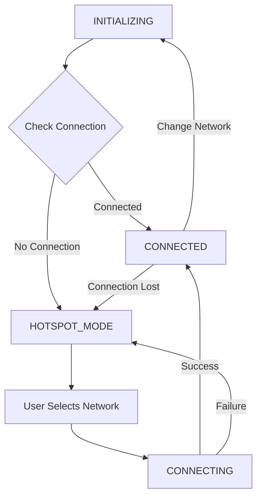

# Distiller WiFi Service

A comprehensive WiFi setup and management service designed for embedded Linux devices (Raspberry Pi CM5, Rockchip boards) with e-ink display support. This service provides an intuitive web interface for WiFi configuration and visual feedback through e-ink displays.

## Features

### WiFi Management
- **Automatic WiFi Setup**: Creates a hotspot when no connection is available
- **Random Device Naming**: Each device gets unique ID to prevent conflicts (e.g., DistillerSetup-A4B2)
- **mDNS Discovery**: Devices advertise themselves via Bonjour/Zeroconf for easy discovery
- **Web-based Configuration**: User-friendly interface for network selection and password entry
- **Connection Monitoring**: Automatic reconnection and health monitoring
- **Network Scanning**: Real-time WiFi network discovery
- **Dynamic IP Detection**: Automatically detects and uses actual hotspot IP address

### E-ink Display Support (via distiller-cm5-sdk)
- **Setup Instructions**: QR codes and connection details during setup
- **Connection Progress**: Visual feedback during WiFi connection
- **Success Confirmation**: Connection success with network details
- **Current Status**: Real-time WiFi information display with tunnel URLs
- **SDK Integration**: Uses distiller-cm5-sdk for hardware abstraction
- **Auto-refresh**: Periodic display updates

### Advanced Features
- **Dynamic Port Configuration**: Configurable web server port
- **State Management**: Robust service state transitions
- **Error Recovery**: Automatic fallback to hotspot mode on connection loss
- **Change Network**: Easy network switching without restart
- **REST API**: JSON endpoints for status and control

## Quick Start

### Prerequisites
- Linux system with NetworkManager
- Python 3.11+
- Root privileges (for network management)
- distiller-cm5-sdk (for e-ink display support)
- E-ink display hardware (optional)

### Debian Package Installation (Recommended)

The easiest way to install is using the Debian package:

1. **Build the package:**
   ```bash
   git clone https://github.com/Pamir-AI/distiller-cm5-services
   cd distiller-cm5-services
   ./build-deb.sh
   ```

2. **Install the package:**
   ```bash
   sudo dpkg -i dist/distiller-cm5-services_*.deb
   sudo apt-get install -f  # Fix any dependency issues
   ```

3. **Start services:**
   ```bash
   sudo systemctl start distiller-wifi
   sudo systemctl start pinggy-tunnel
   ```

**Package Benefits:**
- Installs to `/opt/distiller-cm5-services` (proper system location)
- Handles dependencies intelligently via apt and pip
- Creates convenient command symlinks (`distiller-wifi-setup`, `distiller-tunnel`, etc.)
- Includes systemd service integration
- Proper cleanup on removal

### Manual Installation (Alternative)

If you prefer manual installation:

1. **Install system dependencies:**
   ```bash
   sudo apt update
   sudo apt install python3-fastapi python3-uvicorn python3-pydantic python3-jinja2 \
                    python3-multipart python3-pil python3-numpy python3-qrcode \
                    python3-zeroconf python3-aiohttp network-manager systemd
   ```

2. **Install optional dependencies:**
   ```bash
   sudo apt install python3-evdev python3-spidev python3-lgpio fonts-liberation
   ```

3. **Clone and install:**
   ```bash
   git clone https://github.com/Pamir-AI/distiller-cm5-services
   sudo cp -r distiller-cm5-services /opt/
   cd /opt/distiller-cm5-services
   
   # Install Python dependencies not available via apt
   pip install -r requirements.txt
   
   # Install systemd services
   sudo cp distiller-wifi.service /etc/systemd/system/
   sudo cp pinggy-tunnel.service /etc/systemd/system/
   sudo systemctl daemon-reload
   sudo systemctl enable distiller-wifi pinggy-tunnel
   ```

### Legacy Installation

For systems using the old `/home/distiller` path:

```bash
sudo bash install-service.sh
```

**Note:** The new Debian package uses `/opt/distiller-cm5-services` which is the proper system location for applications.

### Basic Usage

1. **Automatic Setup**: Service automatically starts hotspot mode if no WiFi connection
2. **Connect to Hotspot**: Join "DistillerSetup-XXXX" network (password: "setup123") where XXXX is a unique suffix
3. **Open Web Interface**: Visit the IP address shown on the e-ink display (typically 192.168.4.1:8080)
4. **Configure WiFi**: Select network, enter password, and connect
5. **Automatic Transition**: Service transitions to connected mode and becomes available via mDNS (e.g., distiller-xxxx.local)

## Configuration

### Command Line Options

```bash
sudo python3 distiller_wifi_service.py [OPTIONS]
```

| Option | Default | Description |
|--------|---------|-------------|
| `--ssid` | "DistillerSetup" | Hotspot network name |
| `--password` | "setup123" | Hotspot password |
| `--device-name` | "Distiller" | Device name for display |
| `--port` | 8080 | Web server port |
| `--no-eink` | False | Disable e-ink display |
| `--verbose` | False | Enable debug logging |

### Examples

```bash
# Custom hotspot settings
sudo python3 distiller_wifi_service.py --ssid "MyDevice" --password "mypassword123"

# Different web port
sudo python3 distiller_wifi_service.py --port 9090

# Disable e-ink display (for testing)
sudo python3 distiller_wifi_service.py --no-eink

# Verbose logging
sudo python3 distiller_wifi_service.py --verbose
```

## Service States

The service operates in several distinct states:



### State Descriptions

- **INITIALIZING**: Service startup, checking current network status
- **HOTSPOT_MODE**: Creating WiFi hotspot for configuration
- **CONNECTING**: Attempting to connect to selected network
- **CONNECTED**: Successfully connected to WiFi network
- **ERROR**: Error state with automatic recovery

## Web Interface

### Main Pages

- **`/`** - Network selection and configuration
- **`/status`** - Connection status and monitoring
- **`/confirm`** - Network confirmation before connection
- **`/change-network`** - Change network interface

### API Endpoints

| Endpoint | Method | Description |
|----------|--------|-------------|
| `/api/status` | GET | Current connection status |
| `/api/networks` | GET | Available WiFi networks |
| `/api/connect` | POST | Connect to network |
| `/api/scan` | GET | Trigger network scan |
| `/refresh-display` | GET | Refresh e-ink display |

### API Examples

```bash
# Get current status
curl http://localhost:8080/api/status

# Get available networks
curl http://localhost:8080/api/networks

# Connect to network
curl -X POST http://localhost:8080/api/connect \
  -H "Content-Type: application/json" \
  -d '{"ssid": "MyNetwork", "password": "mypassword"}'

# Refresh e-ink display
curl http://localhost:8080/refresh-display
```

## E-ink Display

### Supported Hardware
- E-ink displays supported by distiller-cm5-sdk (128x250 pixels default)
- SPI interface connection via SDK hardware abstraction
- Compatible with Raspberry Pi CM5 and supported boards

### Display Modes

1. **Setup Mode**: Shows hotspot credentials and QR code
2. **Connecting Mode**: Shows connection progress
3. **Success Mode**: Shows connection confirmation
4. **Info Mode**: Shows current network details

### Manual Display Control

```bash
# Display current WiFi info (requires distiller-cm5-sdk)
.venv/bin/python wifi_info_display.py --display

# Create setup instructions
.venv/bin/python wifi_info_display.py --setup --ssid "MyHotspot" --password "password123" --ip "192.168.4.1"

# Create success screen
.venv/bin/python wifi_info_display.py --success --ssid "HomeNetwork" --connected-ip "192.168.1.100"

# Use convenience wrapper
distiller-display --display
```

## Network Management

### Dynamic IP Detection

The service automatically detects the actual IP address of the hotspot interface and uses it throughout the web interface. This eliminates connectivity issues that can occur with hardcoded IP addresses, especially when accessing from different device types (iPhone, Android, etc.).

### Change Network Workflow

1. User clicks "Change Network" button
2. Service shows countdown and instructions
3. Automatic transition to hotspot mode
4. User reconnects to setup hotspot
5. Select new network and configure

## Logging

### Log Locations
- **System**: `/var/log/distiller-wifi.log` (if writable)
- **Local**: `./distiller-wifi.log` (fallback)
- **Console**: stdout (always enabled)

### Log Levels
- **INFO**: Normal operation events
- **WARNING**: Recoverable issues
- **ERROR**: Service errors
- **DEBUG**: Detailed troubleshooting (with `--verbose`)

## Troubleshooting

### Common Issues

**Service won't start:**
```bash
# Check root privileges
sudo python3 distiller_wifi_service.py

# Check NetworkManager
systemctl status NetworkManager
```

**Can't connect to hotspot:**
```bash
# Check hotspot status
nmcli device wifi list | grep DistillerSetup

# Check firewall
sudo ufw status
```

**E-ink display not working:**
```bash
# Check distiller-cm5-sdk installation
python3 -c "from distiller_cm5_sdk.hardware.eink import display_png"

# Test SDK display functionality
.venv/bin/python wifi_info_display.py --display

# Test without e-ink
.venv/bin/python distiller_wifi_service.py --no-eink

# Check SPI interface (if using custom SDK config)
ls /dev/spi*
```

**Web interface not accessible:**
```bash
# Check port availability
netstat -ln | grep :8080

# Try different port
python3 distiller_wifi_service.py --port 9090

# Check URL fallback
curl http://localhost:8080/api/status
curl http://192.168.4.1:8080/api/status  # Use actual hotspot IP
```

### Debug Mode

Enable verbose logging for detailed troubleshooting:

```bash
# Using virtual environment
sudo .venv/bin/python distiller_wifi_service.py --verbose

# Using package wrapper
sudo distiller-wifi-setup --verbose
```

## System Integration

### Systemd Service

Create `/etc/systemd/system/distiller-wifi.service`:

```ini
[Unit]
Description=Distiller WiFi Setup Service
After=network.target
Wants=network.target

[Service]
Type=simple
User=root
WorkingDirectory=/path/to/distiller-cm5-services
ExecStart=/usr/bin/python3 distiller_wifi_service.py
Restart=always
RestartSec=10

[Install]
WantedBy=multi-user.target
```

Enable and start:
```bash
sudo systemctl enable distiller-wifi.service
sudo systemctl start distiller-wifi.service
```

### Auto-start on Boot

Add to `/etc/rc.local` (before `exit 0`):
```bash
cd /path/to/distiller-cm5-services
python3 distiller_wifi_service.py &
```

## Development

### Project Structure

```
distiller-cm5-services/
├── distiller_wifi_service.py      # Main WiFi service
├── pinggy_tunnel_service.py       # SSH tunnel service  
├── wifi_info_display.py           # E-ink display functions (SDK-based)
├── network/
│   ├── wifi_manager.py            # WiFi management
│   ├── network_utils.py           # Network utilities
│   ├── device_config.py           # Device configuration
│   └── __init__.py
├── templates/                     # Web interface templates
│   ├── index.html                # Network selection
│   ├── status.html               # Status monitoring
│   ├── confirm.html              # Connection confirmation
│   └── change_network.html       # Network change interface
├── static/                       # Web assets
│   ├── css/style.css            # Styling
│   ├── js/wifi-setup.js         # JavaScript functionality
│   ├── images/pamir-logo-01.svg  # Logo
│   └── fonts/                   # MartianMono font for e-ink
├── fonts/                        # Font directory for e-ink display
├── debian/                       # Debian packaging
├── pyproject.toml               # Python project configuration (uv)
├── requirements.txt             # Python dependencies (pip fallback)
└── README.md                   # This file
```

### Testing

```bash
# Syntax check
python3 -m py_compile distiller_wifi_service.py

# Test without hardware (using virtual environment)
.venv/bin/python distiller_wifi_service.py --no-eink --verbose

# Test e-ink display (requires distiller-cm5-sdk)
.venv/bin/python wifi_info_display.py --display

# Test web interface
curl http://localhost:8080/api/status

# Test using package wrappers
distiller-wifi-setup --no-eink --verbose
distiller-display --display
```

## Hardware Requirements

### Minimum Requirements
- ARM-based Linux board (Raspberry Pi, Rockchip, etc.)
- WiFi capability
- 512MB RAM
- Python 3.8+
- NetworkManager

### Recommended Hardware
- Raspberry Pi CM5 or equivalent
- E-ink display supported by distiller-cm5-sdk (128x250 default)
- distiller-cm5-sdk compatible hardware
- 1GB+ RAM for smooth operation

### Hardware Setup

E-ink display connections and configuration are handled by the distiller-cm5-sdk. Refer to the SDK documentation for:
- Supported hardware configurations
- GPIO pin mappings
- SPI interface setup
- Display initialization and configuration

The service automatically detects available hardware through the SDK.

## Building and Packaging

### Debian Package Building

The project includes modern Debian packaging with intelligent dependency handling:

```bash
# Build full package
./build-deb.sh

# Build with specific version
./build-deb.sh -v 1.0.1-1

# Install build dependencies
./build-deb.sh deps

# Clean build artifacts
./build-deb.sh clean
```

**Package Features:**
- Modern debhelper-based packaging
- Automatic dependency resolution (apt + pip fallback)
- Systemd service integration
- Proper installation to `/opt/distiller-cm5-services`
- Lintian quality checks
- Graceful handling of optional dependencies

### Build Requirements

```bash
sudo apt install debhelper dh-python dpkg-dev lintian devscripts
```

### Package Management

After installation:
- Use `distiller-wifi-setup`, `distiller-tunnel`, `distiller-mdns` commands
- Services are available in systemd
- Configuration in `/opt/distiller-cm5-services/`
- Logs via `journalctl -u distiller-wifi` or `journalctl -u pinggy-tunnel`

See [DEBIAN_PACKAGING.md](DEBIAN_PACKAGING.md) for detailed packaging documentation.

## License

This project is part of the Pamir AI Distiller ecosystem. Please refer to the project license for usage terms and conditions.

## Contributing

1. Fork the repository
2. Create a feature branch
3. Make your changes
4. Test thoroughly
5. Submit a pull request

## Support

For issues and questions:
- Check the troubleshooting section
- Review logs with `--verbose` flag
- Create an issue on GitHub
- Test with `--no-eink` for hardware-independent debugging

---

**Note**: This service requires root privileges for NetworkManager operations. Always test in a safe environment before deploying to production systems.
